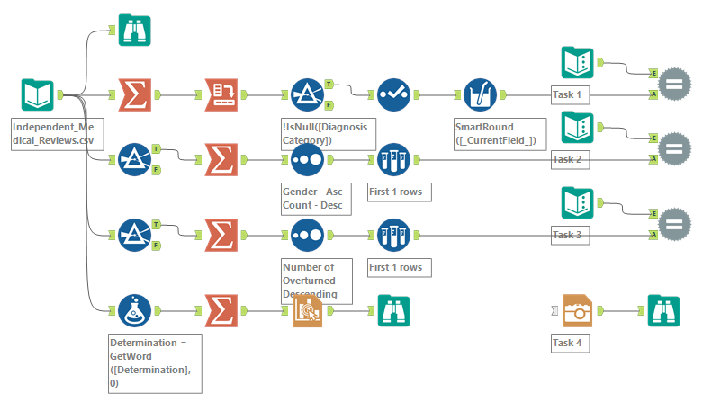

# Alteryx Weekly Challenge 492

## Project Name: Weekly Challenge #492: Trends in Medical Review Decisions
- [Source](https://community.alteryx.com/t5/Weekly-Challenges/Challenge-492-Trends-in-Medical-Review-Decisions/m-p/1415036/highlight/true#M152037)
- [My solution](https://community.alteryx.com/t5/Weekly-Challenges/Challenge-492-Trends-in-Medical-Review-Decisions/m-p/1433061/highlight/true#M154716)

### Summary
  - Read a table, cleanse, summarize, and make a chart.

### Workflow


### Main Process
```
Input Data:
  ..\Local_input\Independent_Medical_Reviews.csv

Output Data:

  Task1: 
    [Diagnosis Category]: Group by
    [Per_Upheld]: Percentage of upheld decision]
    [Per_Overturned]: Percentage of overturned decision]

  Task2:
    Group by
    [Gender],  [Age Range]
    [Count]: Count
    Pick Max Count

  Task3:
    [Diagnosis Category] + [Treatment Category]
    [Number of Overturned]: Max number of overturned decisions

  Task4: 
    [Image]: Line Chart
      X-axis: Year
      Y-axis: CountDecisions
      Line: Decisions ([Overturned], [Upheld])
```

## Last Update
2026-02-28 by Yoshiro Fujimori
