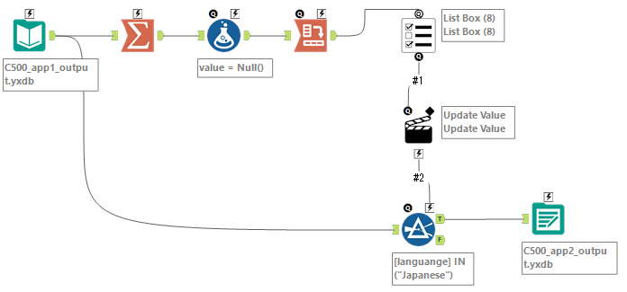

# Challenge500

## Project Name: Weekly Challenge #500: New Year, New Ears
- [Source](https://community.alteryx.com/t5/Weekly-Challenges/Challenge-500-New-Year-New-Ears/m-p/1427578/highlight/true#M153835)
- [My solution](https://community.alteryx.com/t5/Weekly-Challenges/Challenge-500-New-Year-New-Ears/m-p/1432349/highlight/true#M154592)

## App1

### Summary
  - Display a drop down list based on the region
  - Filter the input data with the selected region
  - Pass the output to App2

### Workflow


### Main Process
```
- Input Data
  - Read ..\local_input\podcasts.yxdb
- Summarize
  - Group by [region]
- Formula
  - [value] (V-WString) = Null()
- Cross Tab
  - Change Column Header : [region]
  - Values for New Columns : [value]
  - Retain Special Characters in New Column Names (new!) : True
  - Method for Aggregating Values : First
- Action
  - Update Value / Expression Value / Replace a specific string : 'Japan'
- Filter
  - [region] = "Japan"
- Output Data
  - ..\local_output\C500_app1_output.yxdb
```

### Interface Designer
- On Success - Run Another Analytic App : True
  - C500_app2.yxwz

## App2

### Summary
  - Display a list box based on the languages
  - Filter the input data with the selected languages
  - Pass the output to App3

### Workflow


### Main Process
```
- Input Data
  - ..\local_output\C500_app1_output.yxdb
- Summarize
  - Group by [language]
- Formula
  - [value] (V-WString) = Null()
- Cross Tab
  - Change Column Header : [language]
  - Values for New Columns : [value]
  - Method for Aggregating Values : First
- List Box
  - Generate Custom List : 
    - Start Text : "
    - Separator : ","
    - End Text : "
- Action
  - Update Value / Expression Value / Replace a specific string : "Japanese"
- Filter
  - [language] IN ("Japanese")
- Output Data
  - ..\local_output\C500_app2_output.yxdb
```

### Interface Designer
- On Success - Run Another Analytic App : True
  - C500_app3.yxwz

## App3

### Summary
  - Display a drop down list of the max duration
  - Filter the input data with the selected duration
  - Browse the output

### Workflow


### Main Process
```
- Input Data
  - ..\local_output\C500_app2_output.yxdb

- Summarize
  - [Max_duration_ms]
- Formula
  - [15minutes] (Int32) = CEIL([Max_duration_ms] / 1000 / 60 / 15)
- Generate Rows
  - Create New Field : [RowCount] (Int32)
  - Initialization Expression = 1
  - Condition Expression = RowCount <= [15minutes]
  - Loop Expression = RowCount + 1
- Formula
  - [hour] (V_WString) = 
      IF FLOOR([RowCount] / 4) = 0 
      THEN ""
      ELSEIF FLOOR([RowCount] / 4) = 1
      THEN "1 hour "
      ELSE ToString(FLOOR([RowCount] / 4)) + " hours "
      ENDIF
  - [minutes] (V_WString) =
      IF Mod([RowCount], 4) = 0 
      THEN ""
      ELSE ToString(Mod([RowCount], 4) * 15) + " minutes"
      ENDIF
  - [dropdown] (V_WString) = Trim([hour] + [minutes], " ")
- Cross Tab
  - Change Column Header : [dropdown]
  - Values for New Columns : [RowCount]
  - Retain Special Characters in New Column Names (new!) : True
  - Method for Aggregating Values : Sum

```

## Last Update
2026-02-22

