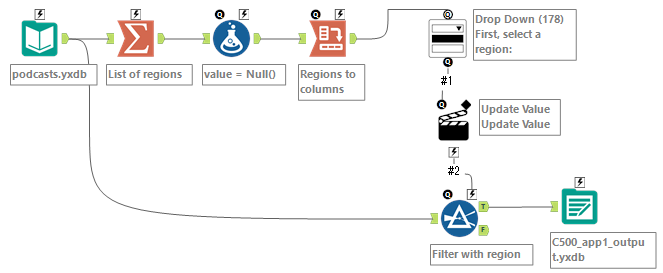
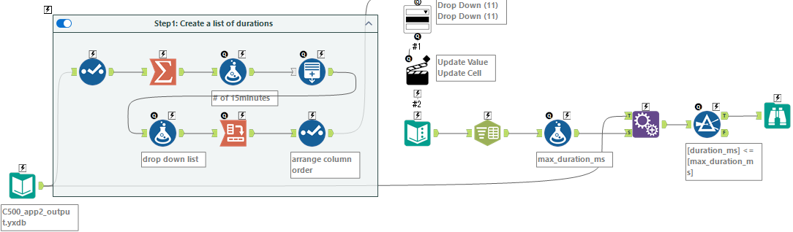

# Challenge500

## Project Name: Weekly Challenge #500: New Year, New Ears
- [Source](https://community.alteryx.com/t5/Weekly-Challenges/Challenge-500-New-Year-New-Ears/m-p/1427578/highlight/true#M153835)
- [My solution](https://community.alteryx.com/t5/Weekly-Challenges/Challenge-500-New-Year-New-Ears/m-p/1432349/highlight/true#M154592)

## App1

### Summary
  - Display a drop down list based on the region
  - Filter the input data with the selected region
  - Pass the output to App2

### Workflow


### Main Process

### Tool Configurations

## App2

### Summary
  - Display a list box based on the languages
  - Filter the input data with the selected languages
  - Pass the output to App3

### Workflow


### Main Process

### Tool Configurations

## App3

### Summary
  - Display a drop down list of the max duration
  - Filter the input data with the selected duration
  - Browse the output

### Workflow


### Main Process
```
```

### Tool Configurations
```
```

## Last Update
2026-02-22

